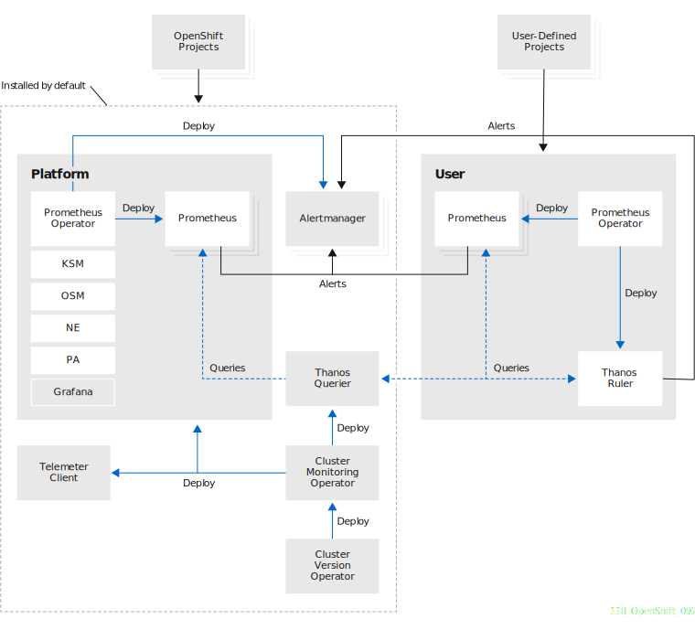

# cp4d-monitors
Additional monitors for IBM Cloud Pak for Data 3.5.X These monitors focus more on the functional usage of IBM Cloud Pak for Data and can be used to provide more insights 
into how the Cloud Pak for Data platform is used by its business users.

Monitors forked from  [original IBM monitors](https://ibm.github.io/cp4d-monitors/) and adapted to CP4D v3.5.X

## Architecture
Overall ideology based on [OpenShift user-defined projects monitoring](https://docs.openshift.com/container-platform/4.7/monitoring/monitoring-overview.html):


CP4D monitored by butch jobs running periodically. Because of that metrics are delivered via [Prometheus pushgateway](https://github.com/prometheus/pushgateway).
## Prerequesites
OpenShift at least v4.6.X  
Cloud pak for data at least v3.5.9  
Internal or external OpenShuft registry with credentials stored in the secret.
## Build
To build monitor image run the following:
```shell
oc new-build https://github.com/kinikiti/monitors \
--context-dir exporter \
--name exporter \
--to <REGISTRY>exporter:latest \
--to-docker=true \
--push-secret='<SECRET>' \
--namespace cpd
```
replace `<SECRET>` by secret name like `docker-pull-cpd--registry` and `<REGISTRY>` with registry URI like `registryhost01.mgmt:5000/cpd/`

This should generate build and buildconfigs, create an image and push this image to registry.
```
# oc get build
NAME         TYPE     FROM          STATUS     STARTED       DURATION
exporter-1   Docker   Git@100f098   Complete   5 weeks ago   1m47s
# oc get buildconfig
NAME       TYPE     FROM   LATEST
exporter   Docker   Git    1
```
## Deploy
Clone the project.  
Monitors require at least empty config map named `monitoring-config`. This is an artefact from CP4D 4.0.X. Deploy this config map:  
```
oc deploy -f YAML/css-cm.yaml
```
Verify:
```
# oc get cm monitoring-config
NAME                DATA   AGE
monitoring-config   0      62d
```
Edit environment variables for metric exporter: in the `YAML/exporter.yaml`:
```yaml
      - env:
        - name: ICPD_CONTROLPLANE_NAMESPACE
          value: cpd
        - name: ICPD_SCRAPE_INTERVAL
          value: "30"
        image: <REGISTRY>/exporter:latest
```
Change `<REGISTRY>` to your registry host. Verify that `ICPD_CONTROLPLANE_NAMESPACE` points to your CP4D namespace (`cpd` by default). Adjust scrape interval changing `ICPD_SCRAPE_INTERVAL` (30 seconds by default)
Deploy metric exporter:
```
oc deploy -f YAML/exporter.yaml
```
Verify:
```
# oc get all -l app=cpd-exporter
NAME                   READY   STATUS    RESTARTS   AGE
pod/exporter-1-5rxf4   1/1     Running   262        32d

NAME                               DESIRED   CURRENT   READY   AGE
replicationcontroller/exporter-1   1         1         1       42d
```
Edit pushgateway config file `YAML/pushgateway.yaml` and replace `<PULL SECRET NAME>` by your pull-secret name.  
Deploy Prometheus push gateway:
```
oc deploy -f YAML/pushgateway.yaml
```
Verify:
```
# oc get all -l app=pushgateway
NAME                                          READY   STATUS    RESTARTS   AGE
pod/pushgateway-deployment-646bf7b857-2chhp   1/1     Running   0          32d

NAME                                     READY   UP-TO-DATE   AVAILABLE   AGE
deployment.apps/pushgateway-deployment   1/1     1            1           41d

NAME                                                DESIRED   CURRENT   READY   AGE
replicaset.apps/pushgateway-deployment-646bf7b857   1         1         1       41d
```
Deploy servicemonitor:
```
oc deploy -f YAML/servicemonitor.yaml
```
Verify:
```
# oc get ServiceMonitor
NAME           AGE
cpd-exporter   41d
```
At that point all components are deployed and metrics shold arrive in OpenShuft Prometheus within few minutes.
## Verification
Setup environment variables. `NAMESPACE` variable must point to your CP4D namespace.
```
NAMESPACE=cpd
SECRET=`oc get secret -n openshift-user-workload-monitoring | grep  prometheus-user-workload-token | head -n 1 | awk '{print $1 }'`
TOKEN=`echo $(oc get secret $SECRET -n openshift-user-workload-monitoring -o json | jq -r '.data.token') | base64 -d`
THANOS_QUERIER_HOST=`oc get route thanos-querier -n openshift-monitoring -o json | jq -r '.spec.host'`
```
Check if the instance is up:
```
# curl -X GET -kG "https://$THANOS_QUERIER_HOST/api/v1/query?" --data-urlencode "query=up{namespace='$NAMESPACE'}" -H "Authorization: Bearer $TOKEN"
{"status":"success","data":{"resultType":"vector","result":[{"metric":{"__name__":"up","container":"exporter","endpoint":"prometheus","instance":"10.131.0.11:9000","job":"cpd-exporter-service","namespace":"cpd","pod":"exporter-1-5rxf4","prometheus":"openshift-user-workload-monitoring/user-workload","service":"cpd-exporter-service"},"value":[1661943345.56,"0"]}]}}
```
Check basib default python monitoring:
```
# curl -X GET -kG "https://$THANOS_QUERIER_HOST/api/v1/query?" --data-urlencode "query=python_info" -H "Authorization: Bearer $TOKEN"
{"status":"success","data":{"resultType":"vector","result":[{"metric":{"__name__":"python_info","container":"pushgateway","endpoint":"pushgateway","exported_job":"CP4D","implementation":"CPython","instance":"10.128.5.34:9091","job":"pushgateway-service","major":"3","minor":"8","namespace":"cpd","patchlevel":"12","pod":"pushgateway-deployment-5958b8f8c7-tlfrj","prometheus":"openshift-user-workload-monitoring/user-workload","service":"pushgateway-service","version":"3.8.12"},"value":[1661943638.949,"1"]}]}}
```
Test one of the CP4D specific metrics:
```
# curl -X GET -kG "https://$THANOS_QUERIER_HOST/api/v1/query?" --data-urlencode "query=jobs_count_total" -H "Authorization: Bearer $TOKEN"
{"status":"success","data":{"resultType":"vector","result":[{"metric":{"__name__":"jobs_count_total","container":"pushgateway","endpoint":"pushgateway","exported_job":"CP4D","instance":"10.128.5.34:9091","job":"pushgateway-service","jobsCount":"jobsCount","namespace":"cpd","pod":"pushgateway-deployment-5958b8f8c7-tlfrj","prometheus":"openshift-user-workload-monitoring/user-workload","service":"pushgateway-service"},"value":[1661945771.62,"14"]}]}}
```
Pay attention, that if you don't have jobs or projects are not running reply will be empty:
```
# curl -X GET -kG "https://$THANOS_QUERIER_HOST/api/v1/query?" --data-urlencode "query=project_total_runtimes_metric" -H "Authorization: Bearer $TOKEN"
{"status":"success","data":{"resultType":"vector","result":[]}}
```
This may be normal.

## Dashboards
